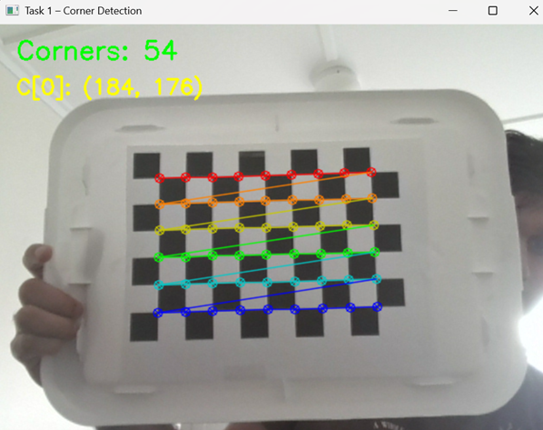
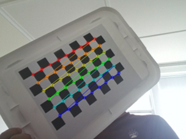
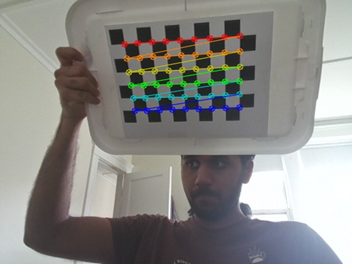
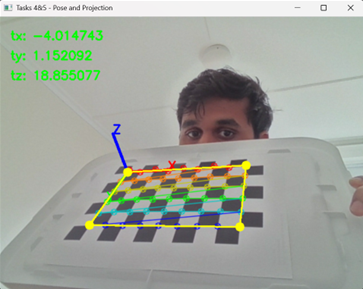
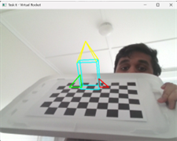
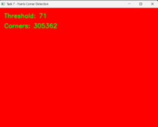
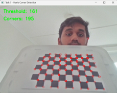
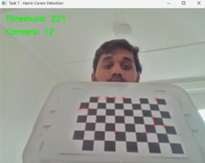

# Project 4: Calibration and Augmented Reality
**CS5330: Pattern Recognition and Computer Vision**  
**Ahilesh Vadivel**

---

## Overview

This project explores camera calibration and augmented reality through a series of incrementally complex computer vision tasks implemented in C++ using OpenCV. Starting from checkerboard corner detection, the project builds up to real-time pose estimation and the projection of a 3D virtual object onto a live video stream.

---

## Dependencies

- C++17 or later
- OpenCV 4.x
- A webcam or camera device

**Build command (Linux/macOS):**
```
g++ -std=c++17 <filename>.cpp -o <output> $(pkg-config --cflags --libs opencv4)
```

---

## Project Structure

| File | Description |
|---|---|
| `task1_corners.cpp` | Detects and draws checkerboard corners in live video |
| `task2_3_calibration.cpp` | Collects calibration frames and computes camera intrinsics |
| `task4_5_pose.cpp` | Estimates board pose and projects 3D axes and outer corners |
| `task6_virtual_object.cpp` | Projects a 3D rocket ship virtual object above the board |
| `task7_features.cpp` | Detects Harris corners in live video with adjustable threshold |
| `camera_params.yml` | Saved calibration output (generated by task2_3_calibration) |

---

## Tasks

### Task 1 - Detect and Extract Target Corners
Detects the internal corners of a 9x6 OpenCV checkerboard in real time using `findChessboardCorners` and refines them to sub-pixel accuracy using `cornerSubPix`.



---

### Task 2 & 3 - Select Calibration Images and Calibrate Camera
Collects calibration frames by pressing `s`, then runs the Zhang calibration method via `calibrateCamera` by pressing `c`. Saves the camera matrix and distortion coefficients to `camera_params.yml` by pressing `w`.

**Calibration Results:**
- fx = fy = 481.90 (square pixels confirmed)
- Principal point: (327.62, 243.75)
- RMS reprojection error: 1.28 px



**Controls:**
- `s` — save current frame (board must be detected)
- `c` — run calibration (minimum 5 frames required)
- `w` — write results to `camera_params.yml`
- `q` — quit

---

### Task 4 - Calculate Current Position of the Camera
Loads `camera_params.yml` and uses `solvePnP` to compute the board's rotation and translation vectors in real time. Translation values are printed to the console and overlaid on the video frame.

---

### Task 5 - Project Outside Corners and 3D Axes
Extends Task 4 by projecting the four outer board corners and a set of 3D coordinate axes (X=red, Y=green, Z=blue) onto the image using `projectPoints`.



---

### Task 6 - Create a Virtual Object
Projects a 3D rocket ship floating above the center of the checkerboard. The rocket consists of a rectangular body (cyan), a nose cone (yellow), and two asymmetric fins (red and green) — all constructed from 3D line segments projected into image space.



---

### Task 7 - Detect Robust Features
Applies the Harris corner detector to a live video stream. The detection threshold is adjustable in real time using `+` and `-` keys, allowing experimentation with detection sensitivity.



**Controls:**
- `+` — increase threshold (fewer corners)
- `-` — decrease threshold (more corners)
- `q` — quit

---

## How to Run

1. Compile the desired task file using the build command above.
2. For Tasks 4 onwards, ensure `camera_params.yml` exists in the same directory (generated by Task 2/3).
3. Run the compiled executable.

> Note: Only one task file should be compiled at a time to avoid linker conflicts with duplicate `main` functions.

---

## Acknowledgements

- Maxwell, B. A. *Fundamentals of Computer Vision*. 2022.
- Shapiro, L. and Stockman, G. *Computer Vision*. Prentice-Hall, 2001.
- OpenCV Documentation: https://docs.opencv.org
- Claude (Anthropic) — used as a programming assistant for code structure, debugging, and documentation.
